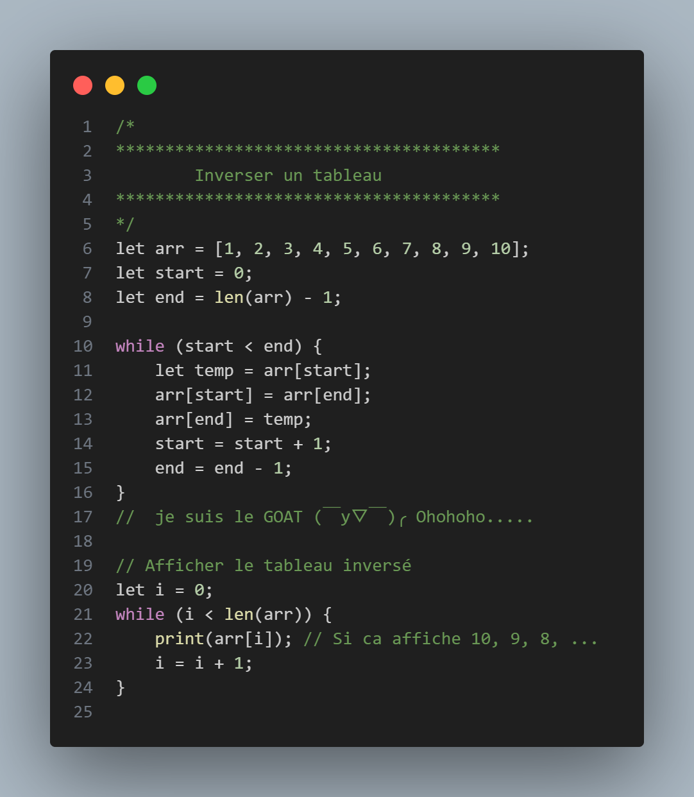

# YB Compiler Project

A modern compiler that parses high-level language syntax and generates x86-64 assembly code.

## Description

This project implements a full-featured compiler with lexical analysis, syntactic parsing, and assembly code generation. The compiler supports a rich set of language features including variables, arithmetic expressions, control structures, arrays, and more - all compiled to optimized x86-64 assembly.

## Code Example

Here's a sample program that demonstrates the compiler's capabilities:



## Features

### Language Constructs
- Variable declarations and assignments (`let x = 42;`)
- Arithmetic expressions (`+`, `-`, `*`, `/`, `%`)
- Comparison operators (`==`, `!=`, `<`, `>`, `<=`, `>=`)
- Logical operators (`&&`, `||`)
- Control flow statements:
  - Conditional branching (`if/else if/else`)
  - Loops (`while`)
- Arrays with dynamic allocation
  - Array literals (`[1, 2, 3]`)
  - Array indexing (`arr[0]`)
  - Array length function (`length(arr)`)
- Block scoping with `{}`
- Comments (single-line `//` and multi-line `/* */`)
- Print statements for output
- Exit statements for program termination

### Compiler Components
- **Lexical Analyzer (Tokenizer)**: Breaks source code into tokens
- **Syntactic Parser**: Builds an Abstract Syntax Tree (AST)
- **Code Generator**: Transforms AST into optimized x86-64 assembly

## Architecture

The compiler follows a traditional three-phase architecture:

1. **Tokenization**: Source code is transformed into a sequence of tokens, each representing the smallest meaningful unit of code (keywords, identifiers, literals, operators, etc.)

2. **Parsing**: Tokens are analyzed according to the grammar rules to build an Abstract Syntax Tree (AST) that represents the hierarchical structure of the program.

3. **Code Generation**: The AST is traversed to generate equivalent x86-64 assembly code, handling memory allocation, register management, and system calls.

## Building the Project

The project uses CMake for building:

```bash
# Create a build directory
mkdir -p build
cd build

# Configure and build with CMake
cmake ..
make
```
## Demo

Here's a demonstration of the compiler in action:

.gif)

## Output

The compiler generates NASM-compatible x86-64 assembly code. Here's a simplified example:

```asm
global _start
section .text
_start:
    push rbp
    mov rbp, rsp
    
    ; Code for array allocation and initialization
    mov rax, 9          ; mmap syscall
    mov rdi, 0          ; let kernel choose address
    mov rsi, 88         ; size in bytes (for array)
    mov rdx, 3          ; PROT_READ | PROT_WRITE
    mov r10, 34         ; MAP_PRIVATE | MAP_ANONYMOUS
    mov r8, -1          ; fd (-1 for anonymous mapping)
    mov r9, 0           ; offset
    syscall
    
    ; Store array length and elements
    mov rbx, [rsp]
    mov qword [rbx], 10 ; array length
    
    ; Other operations like array access, comparisons, loops...
    
    ; Exit syscall
    mov rax, 60
    mov rdi, 0
    syscall
```

## Testing

The project includes a test script that automates compilation, assembly, and execution:

```bash
# Run the test script
./test.sh <source_file>
```

If no source file is provided, the compiler will use a built-in example program.


The script will:
1. Compile the source code to assembly
2. Assemble and link the executable using NASM and ld
3. Run the program
4. Display the results

## Documentation

The codebase is documented using Doxygen comments. Generate the documentation with:

```bash
cd docs
doxygen Doxyfile
```

Then view the HTML documentation in `docs/doxygen/html/index.html`.

## Current Limitations

- No function declarations or calls
- No strings or characters (only integers)
- Limited standard library
- No type checking or safety features
- No compiler optimizations
- Single-file compilation only

## Project Roadmap

### Implemented Features
- ✅ Lexical analysis with comprehensive token recognition
- ✅ Recursive descent parser for building AST
- ✅ Variables and assignment operations
- ✅ Arithmetic and logical expressions
- ✅ Code blocks and scoping
- ✅ Control flow (if/else, while loops)
- ✅ Arrays and array operations
- ✅ Basic memory management
- ✅ Print statement for output

### In Progress
- 🔄 Comprehensive test suite
- 🔄 Error recovery and better diagnostics
- 🔄 More control structures (do-while, for, switch)

### Planned Features
- ⏳ Function definitions and calls
- ⏳ String manipulation
- ⏳ Standard library implementation
- ⏳ Type system
- ⏳ Optimizations (constant folding, dead code elimination)
- ⏳ Multiple file compilation
- ⏳ Object-oriented programming features

## License

This project is licensed under the MIT License - see the [LICENSE](LICENSE) file for details.


